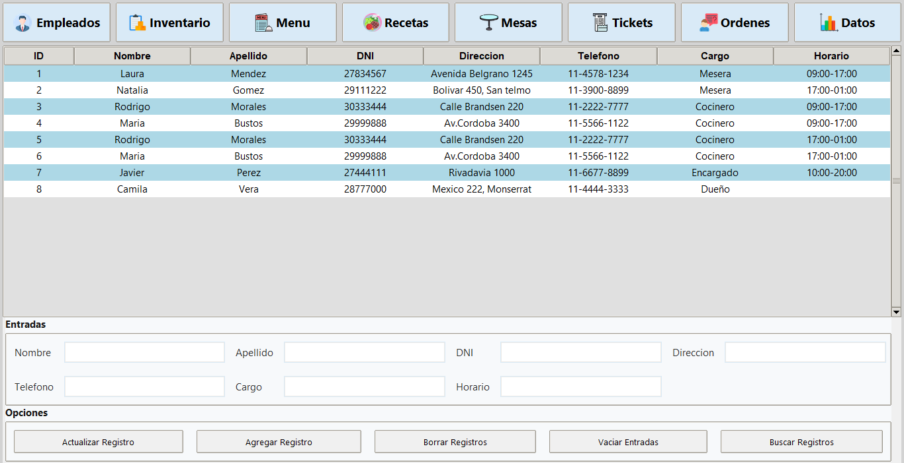
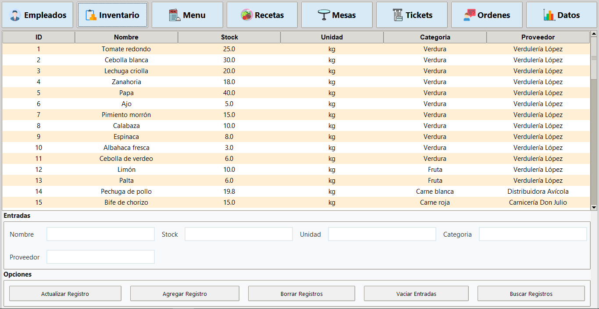
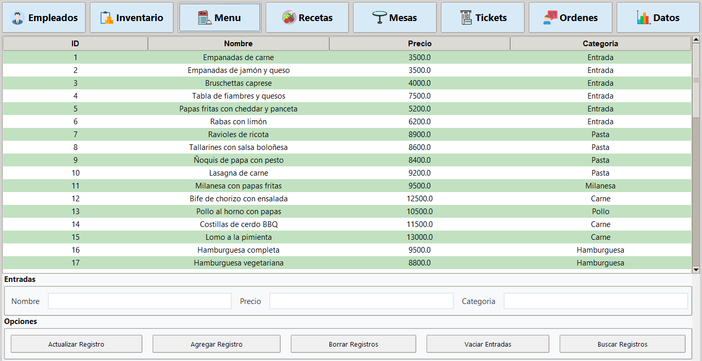
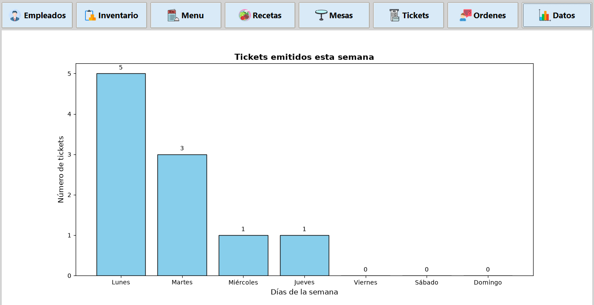

# Mesa10

A desktop restaurant management system developed in Python using Tkinter and SQLite. Mesa10 provides tools for managing employees, inventory, menus, recipes, tables, tickets, orders, and statistical reports through an intuitive graphical interface.

> **Note:** The application interface and documentation are currently available in Spanish.

---

## Features

- Employee management
- Inventory management
- Menu administration
- Recipe management
- Table management
- Ticket management
- Order management
- Statistical reports and data visualization

---

## Technologies

- Python
- SQLite
- Tkinter
- Pillow
- Matplotlib

---

## Screenshots

### Employees



### Inventory



### Menu



### Statistics Dashboard



---

## Installation

Clone the repository:

```bash
git clone https://github.com/BrunoJoseVera/Mesa10-Restaurant-Management-System.git
cd Mesa10-Restaurant-Management-System
```

Install the required dependencies:

```bash
pip install -r requirements.txt
```

Run the application:

```bash
python main.py
```

---

## Documentation

The following documentation is included in the `docs` folder:

- [Manual de Sistema (Spanish)](docs/Manual_de_Sistema.pdf)
- [Manual de Usuario (Spanish)](docs/Manual_de_Usuario.pdf)

---

## Author

**Bruno Jose Vera**
